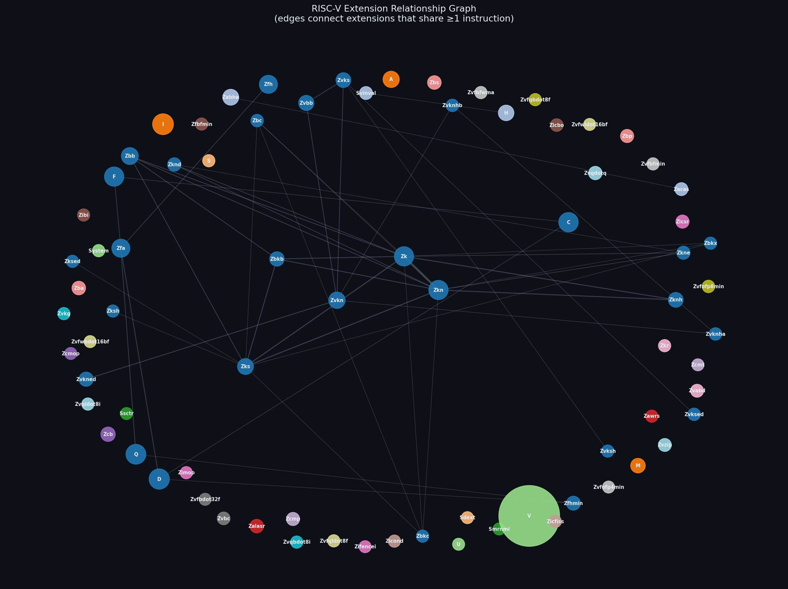

# RISC-V Instruction Set Explorer

A Python tool that parses the RISC-V extension landscape, cross-references it against the
official ISA manual, and visualises which extensions share instructions.

Built for the LFX Mentorship coding challenge: *Mapping the RISC-V Extensions Landscape*.

---

## Quick Start

```bash
# Clone this repo
git clone <your-repo-url>
cd riscv-isa-explorer

# Install dependencies
pip install -r requirements.txt

# Run all three tiers
python main.py
```

The first run clones the ISA manual (~15 s, depth=1).  Subsequent runs use a cached copy under
`~/.cache/riscv-explorer/` and are near-instant.

---

## Usage

```
python main.py                    # run all tiers (default)
python main.py --tier 1           # Tier 1 only: instruction parsing
python main.py --tier 2           # Tier 2 only: ISA manual cross-reference
python main.py --tier 3           # Tier 3 only: extension relationship graph
python main.py --no-cache         # re-fetch everything, ignore local cache
python main.py --no-png           # skip PNG export
python main.py --graph-output out.png   # custom PNG output path
```

---

## What Each Tier Does

### Tier 1 — Instruction Set Parsing

Fetches [`instr_dict.json`](https://github.com/rpsene/riscv-extensions-landscape) and:
- Groups 1188 instructions across 76 canonical extension names
- Prints a summary table: extension | instruction count | example mnemonic
- Lists all 122 instructions that span more than one extension

### Tier 2 — Cross-Reference with the ISA Manual

Clones the [riscv-isa-manual](https://github.com/riscv/riscv-isa-manual) repository and:
- Scans all 136 AsciiDoc source files for extension name references using five regex patterns
- Normalises the 114 raw extension tags from the JSON to 76 canonical names
- Reports: matched, JSON-only, and manual-only extensions with counts

### Tier 3 — Extension Relationship Graph

- Builds an undirected graph where an edge connects two extensions that share at least one instruction
- Prints a terminal summary showing clusters and the top shared instruction pairs
- Exports `extension_graph.png` with community-coloured nodes, sized by instruction count

---

## Sample Output

### Tier 1

```
╔═════════════════╤══════════════╤══════════════════╗
║ Extension Tag   │ Instructions │ Example Mnemonic ║
╟─────────────────┼──────────────┼──────────────────╢
║ rv32_zk         │           10 │ AES32DSI         ║
║ rv64_zba        │            5 │ ADD_UW           ║
║ rv_i            │           37 │ ADD              ║
║ rv_zba          │            3 │ SH1ADD           ║
║ rv_zbb          │           17 │ ANDN             ║
║ ...             │          ... │ ...              ║
╟─────────────────┼──────────────┼──────────────────╢
║ TOTAL           │         1188 │                  ║
╚═════════════════╧══════════════╧══════════════════╝
  114 raw extension tags  →  76 canonical extensions
  (after merging arch variants: rv_zba + rv64_zba → Zba)

Instructions in Multiple Extensions (122 total)
  Mnemonic    Canonical Extensions
  ANDN        Zbb, Zbkb, Zk, Zkn, Zks
  CLMUL       Zbc, Zbkc, Zk, Zkn, Zks
  C_FLD       C, D
  ...
```

### Tier 2

```
╔════════════════╤════════╤════════════════════════════════╗
║ Category       │  Count │ Extensions                     ║
╟────────────────┼────────┼────────────────────────────────╢
║ Matched        │     53 │ A, C, D, F, H, I, M, Q,        ║
║                │        │ Smrnmi, Svinval, V, Zabha, Zba, ║
║                │        │ Zbb, Zbc, Zbkb, Zbkc, ...      ║
╟────────────────┼────────┼────────────────────────────────╢
║ JSON only      │     23 │ S, Sdext, Ssctr, System, U,    ║
║                │        │ Zibi, Zicbo, Zicfiss, ...      ║
╟────────────────┼────────┼────────────────────────────────╢
║ Manual only    │     74 │ B, E, G, Shcounterenw, ...     ║
╚════════════════╧════════╧════════════════════════════════╝

  53 matched, 23 in JSON only, 74 in manual only
```

### Tier 3

```
Extension Relationship Graph
  76 extensions · 48 shared-instruction edges · 49 connected component(s)

  Cluster 1 — Cryptographic (13 extensions)
    Zbb, Zbc, Zbkb, Zbkc, Zbkx, Zk, Zkn, Zknd, Zkne, Zknh, Zks, Zksed, Zksh

  Cluster 2 — Vector Crypto (8 extensions)
    Zvbb, Zvkn, Zvkned, Zvknha, Zvknhb, Zvks, Zvksed, Zvksh
  ...

  Top Shared Instruction Pairs
  Zk  ↔  Zkn    41 shared   AES32DSI, AES32DSMI, ...
  Zk  ↔  Zks    16 shared   ANDN, CLMUL, ...
```

### Extension Graph PNG



---

## Running Tests

```bash
pip install -r requirements.txt
pytest tests/ -v
```

71 tests covering normalization edge cases, grouping logic, and the adoc scanner.
No network access needed — all tests run against local fixtures and temporary files.

CI runs automatically on every push via GitHub Actions (`.github/workflows/test.yml`).

---

## Design Decisions

### Why normalization is the hard part

The JSON uses raw tags like `rv_zba`, `rv64_zba`, `rv32_zknd`, and `rv_c_f`.  The manual uses
clean names like `Zba`, `Zknd`, `C`, `F`.  Most of the mapping is mechanical (strip the arch
prefix, capitalize), but two cases break the pattern:

**Compound tags**: `rv_c_f` looks identical to `rv_smrnmi` after stripping the prefix — one
underscore, two parts.  But `c_f` means "instructions at the intersection of C and F" (two
extensions), while `smrnmi` is a single extension name that starts with the `sm` privilege prefix.
The rule: if the body starts with a known two-letter platform prefix (`sm`, `ss`, `sv`, `sh`,
`sd`), treat the whole body as one name.  Otherwise split on `_`.

**Override cases**: `rv_svinval_h` would be treated as a single name by the platform-prefix rule
(it starts with `sv`), but it actually means the Svinval extension plus the Hypervisor (`H`)
extension.  This gets an explicit override entry rather than a fragile heuristic.

### Raw tags in Tier 1, canonical names in Tier 2

Tier 1 uses the raw tag names from the JSON (`rv_zba`, `rv64_zba`) exactly as the spec requests.
Tier 2 cross-references against the ISA manual using canonical names (`Zba`), because the manual
never says `rv_zba` — it always uses the clean name.

The footer after the Tier 1 table shows the consolidation: `114 raw extension tags → 76 canonical
extensions`, so it's clear what normalization does without hiding the raw data.

### Why five adoc regex patterns instead of one

The AsciiDoc sources use at least five distinct ways to reference extension names:

1. `ext:zba[]` / `extlink:zbb[]` — the preferred macro form
2. `"Zba"` or `` `Zba` `` in section headers (restricted to `=` lines to avoid prose false-positives)
3. `[[ext:zicsr]]` — new-style anchor
4. `[[zbkb-sc,Zbkb]]` — old-style anchor with readable name after the comma
5. `<<#zba>>` / `<<zba>>` — AsciiDoc cross-references; this is the only way `Zba`, `Zbc`,
   and `Zbs` appear in `b-st-ext.adoc`

A single pattern would miss entire extension families.

### Why a shallow clone instead of the GitHub API

Scanning 136 `.adoc` files one at a time over the GitHub API would hit rate limits fast (60
unauthenticated requests/hour).  A `git clone --depth 1` grabs everything in one shot and takes
about 15 seconds.  The clone is cached at `~/.cache/riscv-explorer/isa-manual/` so subsequent
runs skip it entirely.

### Why the graph shows clusters and not raw adjacency

With 76 extension nodes and 48 edges, printing an adjacency list is just noise.  Showing
connected components tells you something useful: the cryptographic extensions form a dense cluster
because many instructions (e.g., `ANDN`, `ROL`, `CLMUL`) were deliberately included in multiple
Zk* sub-extensions to let implementors pick the right subset without code duplication.

### Extension count: 114 raw tags → 76 canonical names

The same extension shows up under multiple raw tags because `instr_dict.json` tracks
architecture-specific variants separately (`rv_zba` for the baseline definition, `rv64_zba` for
the 64-bit encoding).  After normalization these collapse to one canonical name.  The canonical
count (76) is what matters for cross-referencing against the manual.

---

## Assumptions

- The `instr_dict.json` schema is stable: top-level keys are mnemonics, each entry has an
  `extension` field that is a list of strings.
- Extension name matching between JSON and manual is case-insensitive.
- "Manual-only" extensions are names found in `.adoc` files that don't correspond to any JSON
  extension — these include privilege extensions documented in the manual but not in the
  instruction dictionary (e.g., `Zihintpause`, `Smepmp`, `Svnapot`).
- The graph connects extensions at the *canonical* level.  Two raw tags that normalize to the
  same name (`rv_zba`, `rv64_zba`) are treated as one node.
